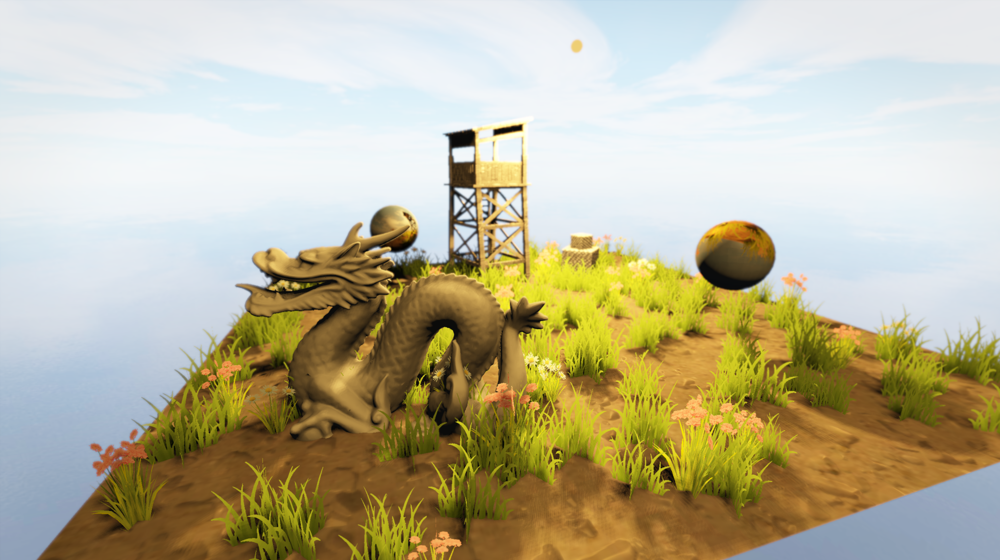
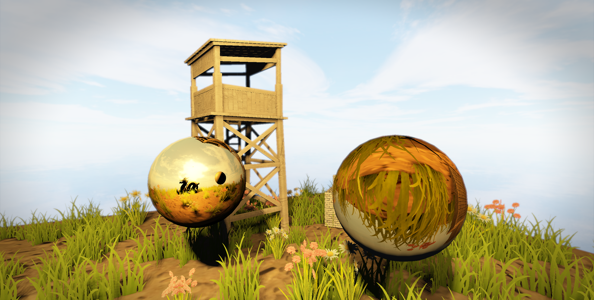
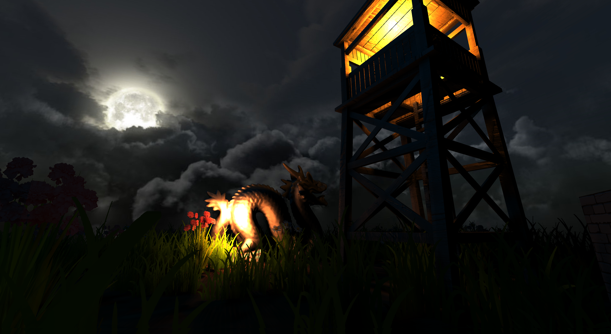
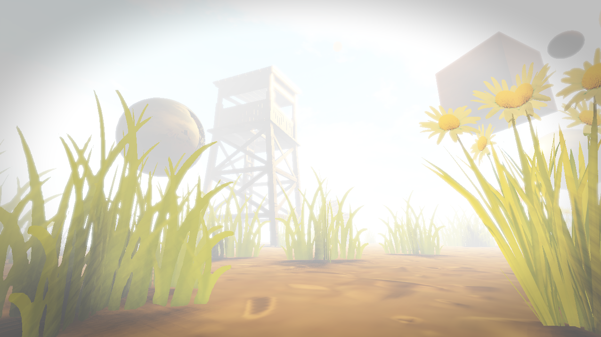

# 3D Rasterizer using OpenGL, C# and GLSL. 

Features:
- Player controlled camera:
	- Top down camera: WASD to move, QE to rotate and mousewheel to zoom in and out
	- First person camera: WASD to move and mouse to look around
- Scenegraph: objects can be children of other objects, which affects their global position. Lights can be added to scenegraph too
- Pointlights using Phong shading model
- Smoothed shadows from pointlights using depthcubes. My shadows cause inter-object shadows and self-shadowing
- Colorful skybox using a cubemap
- Option to use normal map on meshes. If no normal map is provided, then the normals from the .obj file are used
- Support for multiple lights
- Cube mapping (environment maps, shadow maps, skybox etc...)
- Frustum culling by creating bounding spheres around each object and checking if that bounding sphere is inside the view frustum or not
- HDR rendertarget and HDR glow
- Seperable box and gaussian filter with variable kernel width
- Reflective and dieletric materials with textures using environmental maps that update real time
- Interactive lights:
	- Press numbers 0 to 9 to select light 0 to 9 
	- Press - or + to toggle between adding or subtracting to the color of the current selected light
	- Press r, g or b to change the color of the selected light, depending on the mode (+ or -) currently selected
- Multisample anti-aliasing (MSAA) on frame buffer objects. 
	- The multiple different render targets on the frame buffer object used for the first render pass are set to 2x MSAA. Sample count can be changed
- Post processing effects:
	- Chromatic abberation
	- Vignette
	- Color invert
	- Fog by using the depth buffer
	- Depth of field with auto focus by using the depth buffer and three different levels of blurred images. Try to focus on different things. Unfortunately didn't add smooth focus transition though.
	- Small feature to be able to apply non-seperable filter kernels at the last step of post processing
		- Two 5x5 filter kernels added as example
	
A few extra notes:
- In MyApplication.cs there are a couple of toggleable settings. They are all turned on by default. This includes:
	- Enable postprocessing, enable depth of field, enable first person camera, enable shadows and enable bloom
	- You can turn off Depth of field to see the chromatic abberation more clearly (if you feel like you can't see it well enough)
- In fs_blurFilter.glsl in the main function you can call applyBoxBlur() instead of applyGaussianBlur() to view a box blur. I made the standard blur gaussian because it looks better
- In fs_post.glsl there is a boolean to toggle fog and to change fog intensity. In the main function of this file you can also toggle (filter kernel) effects.

